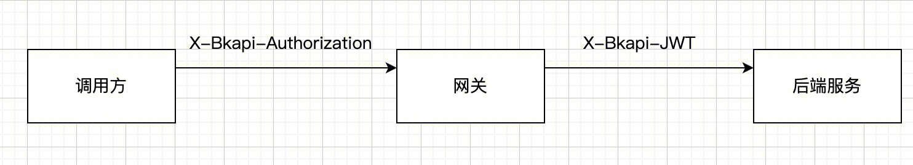

# jwt 说明

后端服务接入网关时, 接口可能开启了应用认证/用户认证, 此时调用方需要传认证header头 `X-Bkapi-Authorization`, 网关认证通过后, 会生成一个 `X-Bkapi-JWT` 头给到后端服务, 里面包含了认证结果信息, 这是一个 jwt token



## 如何获取网关公钥

后端服务如需解析 API 网关发送的请求头 X-Bkapi-JWT，需要提前获取该网关的公钥。获取网关公钥，有以下方案。

### 1. 根据 SDK 提供的 Django Command 拉取

在同步网关数据时，直接添加以下 Command 拉取网关公钥。网关公钥将保存在 model Context 对应的库表 apigw_manager_context 中，SDK 提供的 Django 中间件将从表中读取网关公钥。

```python
# 默认拉取 settings.BK_APIGW_NAME 对应网关的公钥
python manage.py fetch_apigw_public_key

# 拉取指定网关的公钥
python manage.py fetch_apigw_public_key --gateway-name my-gateway
```

### 2. 直接获取网关公钥，配置到项目配置文件

服务仅需接入一些固定的网关部署环境时，可在网关管理端，网关基本信息中查询网关公钥，并配置到项目配置文件。

蓝鲸官方网关，需要自动注册并获取网关公钥，可联系蓝鲸官方运营同学，在服务部署前，由官方提前创建网关，并设置网关公钥、私钥，同时将网关公钥同步给后端服务。
具体可参考 helm-charts 仓库的 README。

### 3. 通过网关公开接口，拉取网关公钥

API 网关提供了公钥查询接口，后端服务可按需根据接口拉取网关公钥，接口信息如下：

```bash
# 将 bkapi.example.com 替换为网关 API 地址，
# 将 gateway_name 替换为待查询公钥的网关名，
# 提供正确的蓝鲸应用账号
curl -X GET 'https://bkapi.example.com/api/bk-apigateway/prod/api/v1/apis/{gateway_name}/public_key/' \
  -H 'X-Bkapi-Authorization: {"bk_app_code": "my-app", "bk_app_secret": "secret"}'
```

响应样例：

```json
{
    "data": {
        "public_key": "your public key"
    }
}
```

注意事项：

- 拉取公钥时，不能实时拉取，需要添加缓存（实时拉取会导致整体接口性能下降）

## 校验请求来自 API 网关

### 场景一：Django 项目

要在后端服务中认证 API 网关传递过来的请求头 `X-Bkapi-JWT`，可以通过在 settings 中的 MIDDLEWARE 中添加以下 Django 中间件。这样，在请求处理过程中，会自动解析请求头中的 X-Bkapi-JWT，并将相关信息添加到 request 对象中。

```python
MIDDLEWARE += [
    "apigw_manager.apigw.authentication.ApiGatewayJWTGenericMiddleware",  # JWT 认证，解析请求头中的 X-Bkapi-JWT，获取 request.jwt 对象
    "apigw_manager.apigw.authentication.ApiGatewayJWTAppMiddleware",  # 根据 request.jwt，获取 request.app 对象
]
```

添加以上两个中间件后，request 对象中将会添加 `request.jwt` 和 `request.app` 两个对象。这些对象包含了网关名、当前请求的蓝鲸应用 ID 等信息。具体内容可参考下文。

如果需要在 request 对象中获取当前请求用户 `request.user` 对象，除了上面的中间件外，还需要添加一个中间件以及 AUTHENTICATION_BACKENDS：

```python
# 添加中间件
MIDDLEWARE += [
    "apigw_manager.apigw.authentication.ApiGatewayJWTUserMiddleware",  # 根据 request.jwt，获取 request.user 对象
]

# 添加 AUTHENTICATION_BACKENDS
AUTHENTICATION_BACKENDS += [
    "apigw_manager.apigw.authentication.UserModelBackend",
]
```

注意，Django 中间件 ApiGatewayJWTGenericMiddleware 解析 `X-Bkapi-JWT` 时，需要获取网关公钥，SDK 默认从以下两个位置获取网关公钥：

- SDK model Context (库表 apigw_manager_context)，需提前执行 `python manage.py fetch_apigw_public_key` 拉取并保存网关公钥

- settings.APIGW_PUBLIC_KEY，可在网关基本页面/API公钥通过点击`复制`按钮或者`下载`获取公钥，并配置到 settings 中。

> 公钥示例：
> ```shell
> -----BEGIN PUBLIC KEY-----
> xxxxxxxxx
> -----END PUBLIC KEY-----
> ```

#### Django 中间件

##### ApiGatewayJWTGenericMiddleware

利用网关公钥，解析请求头中的 X-Bkapi-JWT，在 `request` 中注入 `jwt` 对象，有以下属性：

- `gateway_name`：传入的网关名称；

##### ApiGatewayJWTAppMiddleware

根据 `request.jwt`，在 `request` 中注入 `app` 对象，有以下属性：

- `bk_app_code`：调用接口的应用；

- `verified`：应用是否经过认证；

##### ApiGatewayJWTUserMiddleware

根据 `request.jwt`，在 `request` 中注入 `user` 对象:

- 如果用户通过认证：其为一个 Django User Model 对象，用户名为当前请求用户的用户名
- 如果用户未通过认证，其为一个 Django AnonymousUser 对象，用户名为当前请求用户的用户名

如果中间件 `ApiGatewayJWTUserMiddleware` 中获取用户的逻辑不满足需求，可以继承此中间件并自定义用户获取方法 `get_user`，例如：：

```python
class MyJWTUserMiddleware(ApiGatewayJWTUserMiddleware):
  def get_user(self, request, gateway_name=None, bk_username=None, verified=False, **credentials):
      ...
      return auth.authenticate(
          request, gateway_name=gateway_name, bk_username=bk_username, verified=verified, **credentials
      )
```

注意：在自定义中间件 `ApiGatewayJWTUserMiddleware` 时，如果继续使用 `auth.authenticate` 获取用户，请确保正确设置用户认证后端，以遵循 Django `AUTHENTICATION_BACKENDS` 相关规则。

#### 用户认证后端

##### UserModelBackend

- 已认证的用户名，根据 `UserModel` 创建一个用户对象，不存在时返回 `None`；
- 未认证的用户名，返回 `AnonymousUser`，可通过继承后修改 `make_anonymous_user` 的实现来定制具体字段；

#### 本地开发测试

本地开发测试时，接口可能未接入 API 网关，此时中间件 `ApiGatewayJWTGenericMiddleware` 无法获取请求头中的 X-Bkapi-JWT。
为方便测试，SDK 提供了一个 Dummy JWT Provider，用于根据环境变量直接构造一个 request.jwt 对象。

在项目中添加本地开发配置文件 `local_settings.py`，并将其导入到 settings；然后，在此本地开发配置文件中添加配置：

```python
BK_APIGW_JWT_PROVIDER_CLS = "apigw_manager.apigw.providers.DummyEnvPayloadJWTProvider"
```

同时提供以下环境变量（非 Django settings)

```python
APIGW_MANAGER_DUMMY_GATEWAY_NAME      # JWT 中的网关名
APIGW_MANAGER_DUMMY_PAYLOAD_APP_CODE  # JWT payload 中的 app_code
APIGW_MANAGER_DUMMY_PAYLOAD_USERNAME  # JWT payload 中的 username
```

### 场景二：非 Django 项目

非 Django 项目，需要项目获取网关公钥，并解析请求头中的 X-Bkapi-JWT；获取网关公钥的方案请参考上文。

解析 X-Bkapi-JWT 时，可根据 jwt header 中的 kid 获取当前网关名，例如：

```json
{
    "iat": 1701399603,
    "typ": "JWT",
    "kid": "my-gateway",   # 网关名称
    "alg": "RS512"         # 加密算法
}
```

可从 jwt 内容中获取网关认证的应用、用户信息，例如：

```json
{
  "user": {                  # 用户信息
    "bk_username": "admin",  # 用户名，解析时需同时支持 bk_username、username 两个 key，如 user.get("bk_username") or user.get("username", "")
    "verified": true         # 用户是否通过认证，true 表示通过认证，false 表示未通过认证
  },
  "app": {                    # 蓝鲸应用信息
    "bk_app_code": "my-app",  # 蓝鲸应用ID，解析时需同时支持 bk_app_code、app_code 两个 key，如 app.get("bk_app_code") or app.get("app_code", "")
    "verified": true          # 应用是否通过认证，true 表示通过认证，false 表示未通过认证
  },
  "exp": 1701401103,      # 过期时间
  "nbf": 1701399303,      # Not Before 时间
  "iss": "APIGW"          # 签发者
}
```