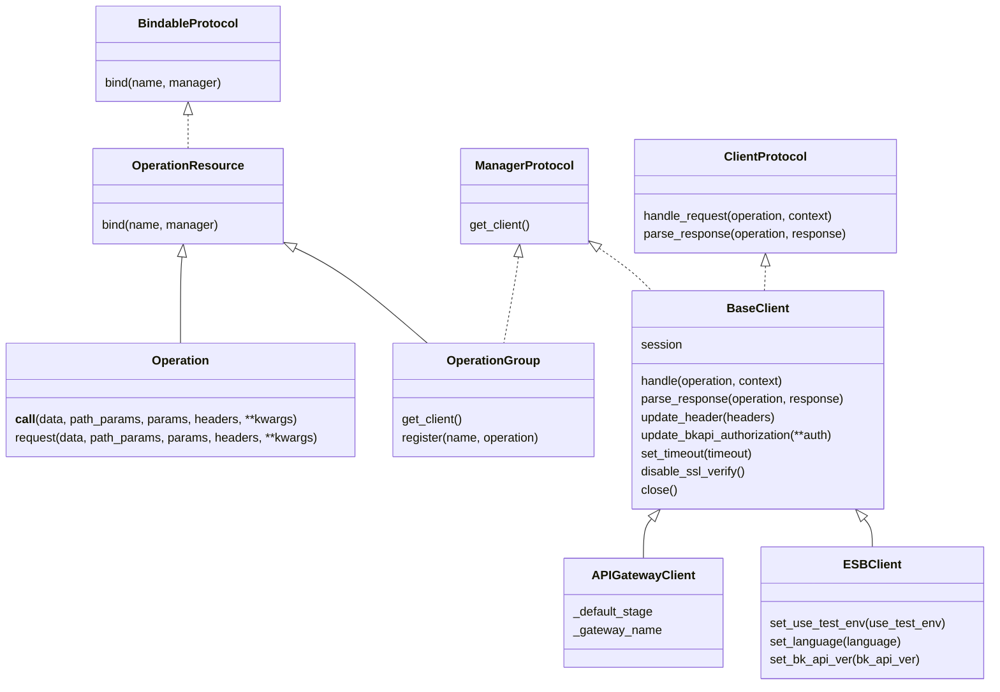

```mermaid
classDiagram

class BindableProtocol {
	bind(name, manager)
}

class ClientProtocol {
	handle_request(operation, context)
	parse_response(operation, response)
}

class ManagerProtocol {
	get_client()
}

class OperationResource {
	bind(name, manager)
}

BindableProtocol <|.. OperationResource

class Operation {
	__call__(data, path_params, params, headers, **kwargs)
	request(data, path_params, params, headers, **kwargs)
}

OperationResource <|-- Operation

class OperationGroup {
	get_client()
	register(name, operation)
}

ManagerProtocol <|.. OperationGroup
OperationResource <|-- OperationGroup

class BaseClient {
	session

	handle(operation, context)
	parse_response(operation, response)
	update_header(headers)
    update_bkapi_authorization(**auth)
	set_timeout(timeout)
	disable_ssl_verify()
	close()
}

ClientProtocol <|.. BaseClient
ManagerProtocol <|.. BaseClient

class APIGatewayClient {
	_default_stage
	_gateway_name
}

BaseClient <|-- APIGatewayClient

class ESBClient {
	set_use_test_env(use_test_env)
	set_language(language)
	set_bk_api_ver(bk_api_ver)
}

BaseClient <|-- ESBClient
```

